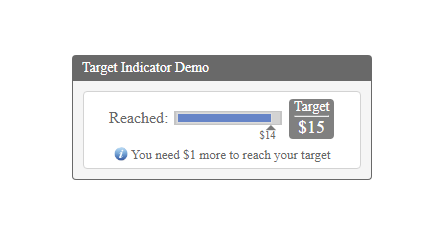
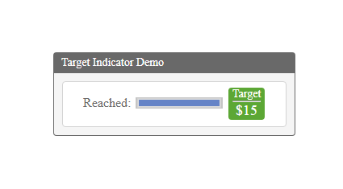

"# TargetIndicator" 

1. Get initial value($14)
2. Progress bar sets initial value and grows to MaxValue($15)
3. When the target is reached the target panel turns green

Framworks:
JQuery, Ajax, Css, Bower

Images
1. Start view

2. Target is reached

